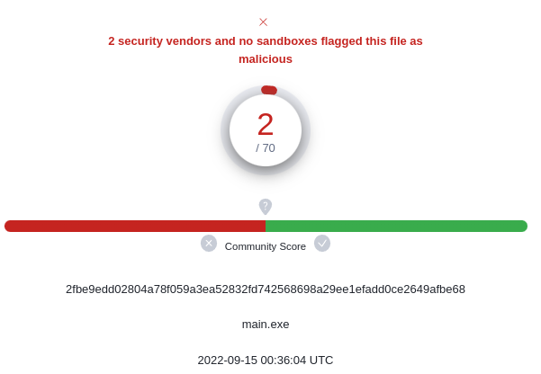
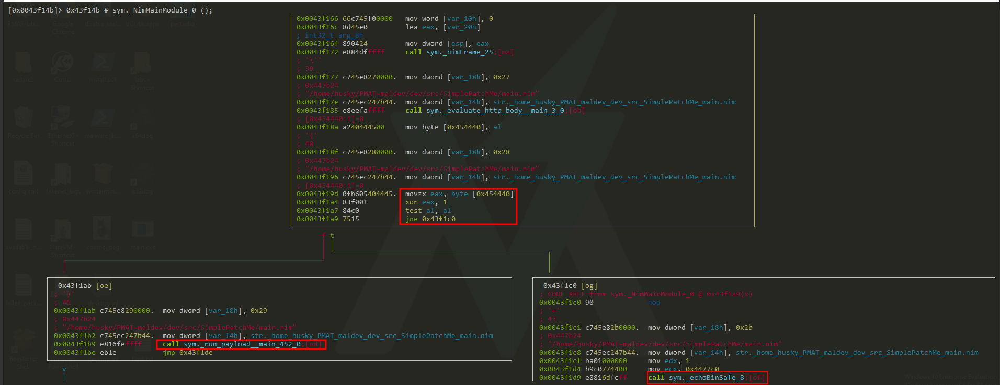
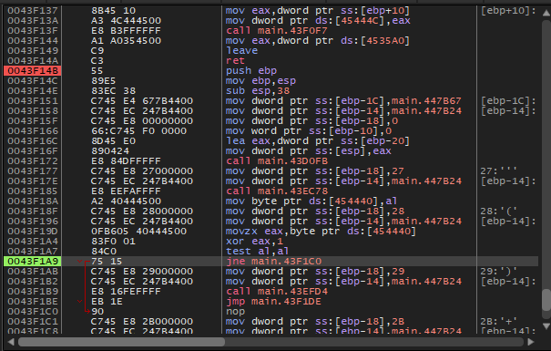

<center><b>Main.exe</b></center> <br>
<center>Patrick Loyd</center>           <br>
<center>PMAT</center>                   <br>
<center>June 7, 2023</center>           <br>

---

[Malware Download](https://github.com/HuskyHacks/PMAT-labs/blob/main/labs/2-4.BinaryPatching/SimplePatchMe/main.exe)
<br>

---

### <u>Static Analysis</u>
###### Hashes:
| Hashing Algorithm | Value |
| ------------------------ | ------------------------------------------------------------------------------------ | 
| md5                    | d0d18b00554cedeab462d7386d6d1791                                                   |
| sha1                   | d30723656e1c98dfad6aa7b3f4642d25ecc41f5e                                           |
| sha256                 | 2fbe9edd02804a78f059a3ea52832fd742568698a29ee1efadd0ce2649afbe68                   |
| os                     | windows                                                                            |
| format                 | pe                                                                                 |
| arch                   | i386                                                                               |
| path                   | main.exe                                                                           |

###### Virus Total


[vt_full_link](https://www.virustotal.com/gui/file/2fbe9edd02804a78f059a3ea52832fd742568698a29ee1efadd0ce2649afbe68/summary)


###### Strings:
Note: Links Defanged Using [Cyber Chef](https://gchq.github.io/CyberChef/)

```
@http://freetshirts.local/key.crt
```


###### API Calls:
Malicious API Calls [malapi](https://malapi.io/#)
 
- GetCurrentProcessId
- VirtualProtect
- GetCurrentThreadId
- TerminateProcess

---

### <u>Dynamic Analysis</u>

#### Dry Run <br>

The executable produces two errors on initial detonation. 
No other indicators were found on the victim machine


#### Internet Simulation<br>
The malware only produces one error response when there is internet connection.


##### Network Indicators:

The malware does reach out to the DNS server for freeshirts.local.


---

### <u>Binary/Executable Analysis</u>

The main function forks into two main decisions. 




With or without internet connection, the function echoBinSafe is called.
This done when the function evaluate_http_body__main_ is called.
The function will return 0 for false each time suggesting more than just a connection is requred.
If the domain is found, then the first error message is not shown.
The program then flips the boolean value return when the instruction xor eax, 1 is executed.
The test will determine that they are not equal and will jump to the echoBinSafe function.



To discover the other branch of the main function, a patch was implemented.
The instruction jne 0x43f1c0 at offset 0x0043f1a9 was changed to je 0x43f1c0.

This changed to program to run the run_payload__main_ function which prints [!] Boom


--- 


