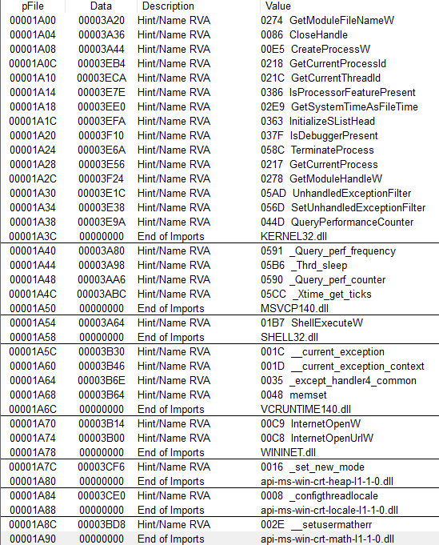
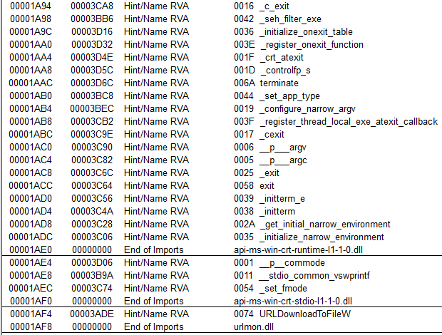
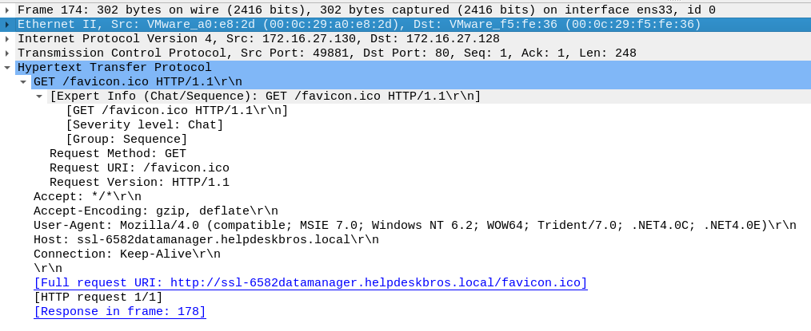
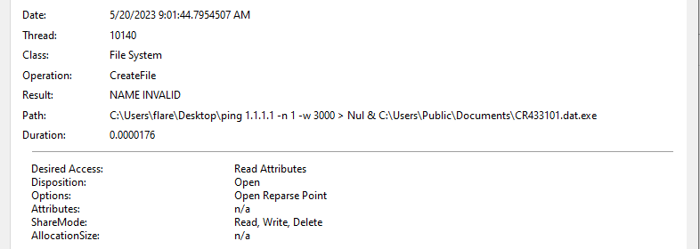
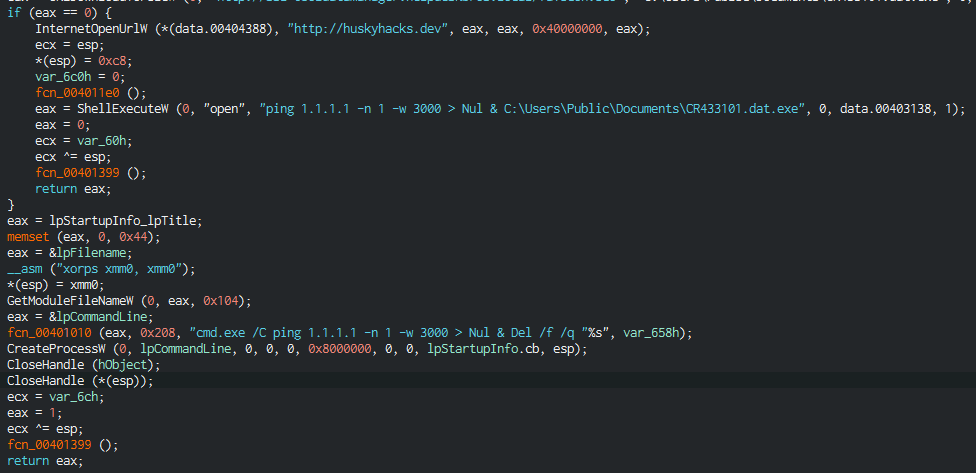

<center><b>Malware.Unknown.exe.malz Report</b></center>
<center><b>Dropper.DownloadFromURL.exe</b></center>
<center>Patrick Loyd</center>
<center>PMAT</center>
<center>May 19, 2023</center>
<br>

---

### <u>Static Analysis</u>
###### Hashes:
| Hashing Algorithm | Value |
| ------------------------ | ------------------------------------------------------------------------------------ | 
| md5                    | 1d8562c0adcaee734d63f7baaca02f7c                                                   |
| sha1                   | be138820e72435043b065fbf3a786be274b147ab                                           |
| sha256                 | 92730427321a1c4ccfc0d0580834daef98121efa9bb8963da332bfd6cf1fda8a                   |
| os                     | windows                                                                            |
| format                 | pe                                                                                 |
| arch                   | i386                                                                               |
| path                   | Malware.Unknown.exe                                                                |
---
###### Virus Total

[vt_full_link](https://www.virustotal.com/gui/file/92730427321a1c4ccfc0d0580834daef98121efa9bb8963da332bfd6cf1fda8a/detection)

---

###### Strings:
> Note: Links Defanged Using [Cyber Chef](https://gchq.github.io/CyberChef/)

```
jjjj
cmd.exe /C ping 1.1.1.1 -n 1 -w 3000 > Nul & Del /f /q "%s"
hxxp[://]ssl-6582datamanager[.]helpdeskbros[.]local/favicon[.]ico
C:\Users\Public\Documents\CR433101.dat.exe
Mozilla/5.0
hxxp[://]huskyhacks[.]dev
ping 1.1.1.1 -n 1 -w 3000 > Nul & C:\Users\Public\Documents\CR433101.dat.exe
open
C:\Users\Matt\source\repos\HuskyHacks\PMAT-maldev\src\DownloadFromURL\Release\DownloadFromURL.pdb
```
---
###### API Calls:
> Malicious API Calls [malapi](https://malapi.io/#)<br>

---

---

---

### <u>Dynamic Analysis</u>


###### Network Indicators
> No Internet Simulation<br>

```
if no connection present, 
then,
    malware deletes iteself from the disk
else, 
    execute malware
```

> Internet Simulation<br>

###### Packet Overview

---
###### Packet Details

---

###### Host Indicators
> Internet Simulation<br>

###### Procmon Overview: 

---
###### Procmon Details:


---

### Biary/Executable Analysis

The main part of this program is displayed in the picture below.
As the dynamic analysis suggests, the program attempts to access the favicon.ico url.
If the program is successful, a ping command is issued to 1.1.1.1 
and the CR433101.dat.exe file is executed. 
If the program is not able to download the file, then the same ping command is issued
and the file is deleted from the disk.



--- 


