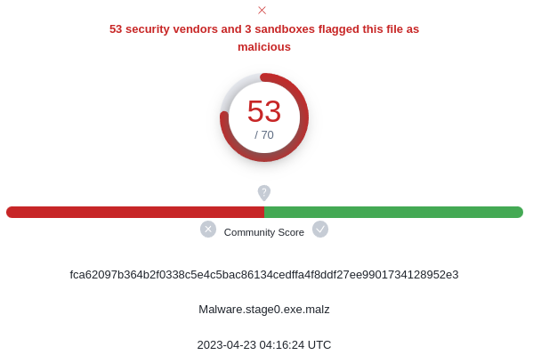
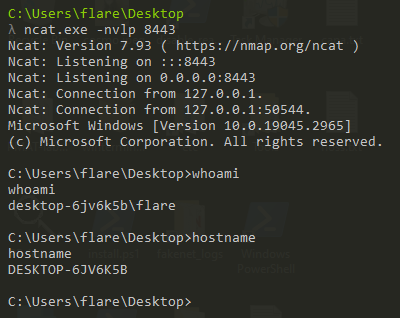
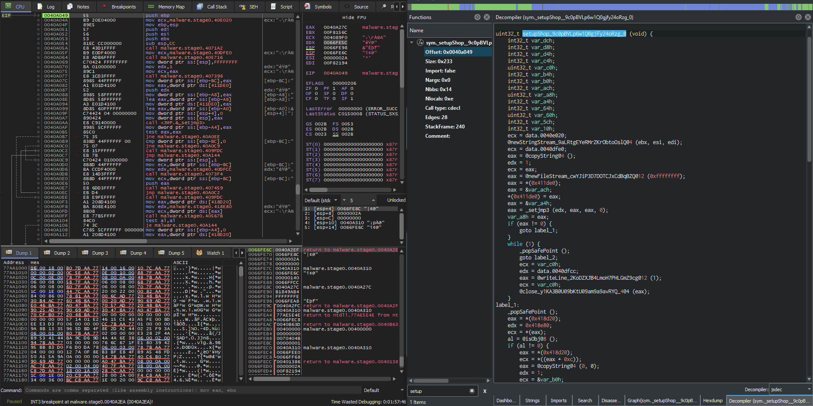

<center><b>Malware.stage.exe</b></center> <br>
<center>Patrick Loyd</center>           <br>
<center>PMAT</center>                   <br>
<center>May 27, 2023</center>           <br>

---

[Malware Download](https://github.com/HuskyHacks/PMAT-labs/blob/main/labs/2-1.AdvancedStaticAnalysis/Malware.stage0.exe.malz/Malware.stage0.exe.malz.7z)
<br>

---

### <u>Static Analysis</u>
###### Hashes:
| Hashing Algorithm | Value |
| ------------------------ | ------------------------------------------------------------------------------------ | 
| md5                    | 6d8895c63a77ebe5e49b656bdefdb822                                                   |
| sha1                   | de8fb0deb6a0ac1f621950270f0ee312357401d7                                           |
| sha256                 | fca62097b364b2f0338c5e4c5bac86134cedffa4f8ddf27ee9901734128952e3                   |
| os                     | windows                                                                            |
| format                 | pe                                                                                 |
| arch                   | i386                                                                               |
| path                   | Malware.stage0.exe.malz                                                            |

###### Virus Total


[vt_full_link](https://www.virustotal.com/gui/file/fca62097b364b2f0338c5e4c5bac86134cedffa4f8ddf27ee9901734128952e3/summary)


###### Strings:
Note: Links Defanged Using [Cyber Chef](https://gchq.github.io/CyberChef/)

```
GNU C99 9.2-win32 20191008 -m32 -mtune=generic -march=pentiumpro -g -O2 -std=gnu99 -fno-PIE
./mingw-w64-crt/crt/tlsthrd.c
./build/i686-w64-mingw32-i686-w64-mingw32-crt
@C:\Users\Public\werflt.exe
@C:\Windows\SysWOW64\WerFault.exe
@C:\Users\Public\werflt.exe
C:\Users\Administrator\source\repos\CRTInjectorConsole\Release\CRTInjectorConsole.pdb
```


###### API Calls:
Malicious API Calls [malapi](https://malapi.io/#)
 
- GetCurrentProcessId
- VirtualProtect
- GetCurrentThreadId
- TerminateProcess

---

### <u>Dynamic Analysis</u>

#### Dry Run <br>

On initial detonation, the process Malware.stage0.exe and WerFault were created<br>
A connection to localhost on port 8443 is also attempted. 


##### Host Indicators:

The process WerFault.exe was started from the stage0 parent process.
This also indicates that the process WerFault.exe and werflt.exe are two seperate processes. 
Any process with a similar spelling to a well-known process is suspicious and more Analysis needs to be performed.


The process operations indicates that is attempts to make a connection to localhost on port 8443.


The following shows the tree of processes that are started from the malware. 


The following files are created from the malicious process. 


The process starts WerFault.exe in a suspended state.


##### Network Indicators:

tcpview confirms that the process WerFault.exe attempts to make a connection to localhost on port 8443


#### Internet Simulation<br>

##### Host Indicators:

After the WerFault.exe process suspension, the process is passed to the malcious service werflt.exe


##### Network Indicators:
The malware establishes a reverse shell connection on localhost:8443




---

### Binary/Executable Analysis

#### Malware.stage0.exe

The main function eventually calls the function setupShop_9c0pBVLp6w1Q0gjfy24oRzg_0 
at offset 0x0040a049.





#### werflt.exe

--- 

### Debugging


