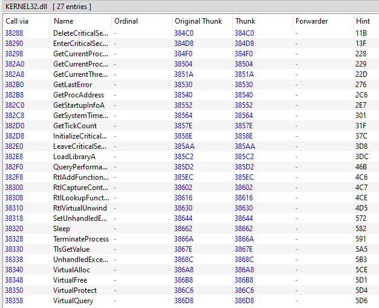
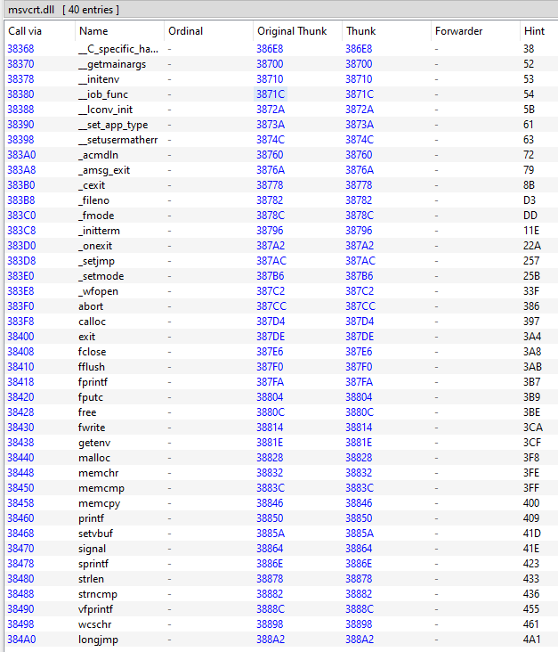
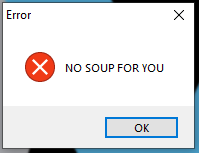
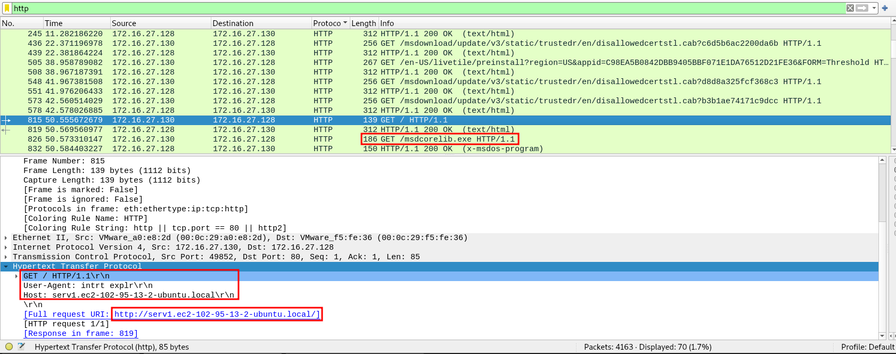
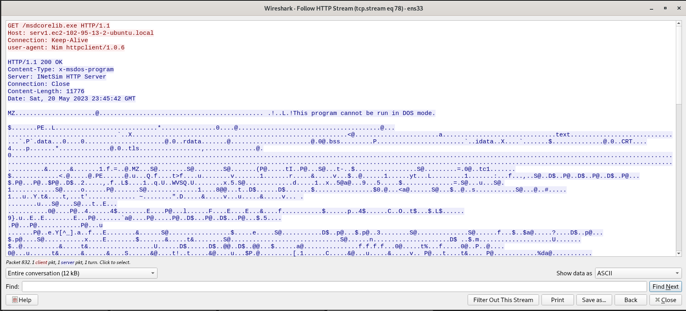
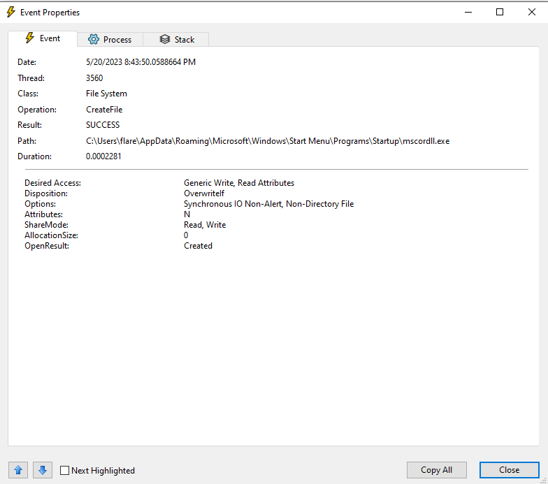

<center><b>RAT.Unknown.exe</b></center>
<center>Patrick Loyd</center>
<center>PMAT</center>
<center>May 20, 2023</center>
<br>

---

### <u>Static Analysis</u>
###### Hashes:
| Hashing Algorithm | Value |
| ------------------------ | ------------------------------------------------------------------------------------ | 
| md5                    | 689ff2c6f94e31abba1ddebf68be810e                                                   |
| sha1                   | 69b8ecf6b7cde185daed76d66100b6a31fd1a668                                           |
| sha256                 | 248d491f89a10ec3289ec4ca448b19384464329c442bac395f680c4f3a345c8c                   |
| os                     | windows                                                                            |
| format                 | pe                                                                                 |
| arch                   | x86                                                                              |
| path                   | RAT.Unknown.exe.malz, werfault.exe, RemoteAcess.exe, Dropper.DownFromURL.exe

###### Virus Total

[vt_full_link](https://www.virustotal.com/gui/file/248d491f89a10ec3289ec4ca448b19384464329ckkj442bac395f680c4f3a345c8c/summary)


###### Strings:
Note: Links Defanged Using [Cyber Chef](https://gchq.github.io/CyberChef/)

```
<?xml version="1.0" encoding="UTF-8" standalone="yes"?><assembly xmlns="urn:schemas-microsoft-com:asm.v1" manifestVersion="1.0"><assemblyIdentity version="1.0.0.0" processorArchitecture="*" name="winim" type="win32"/><dependency><dependentAssembly><assemblyIdentity type="win32" name="Microsoft.Windows.Common-Controls" version="6.0.0.0" processorArchitecture="*" publicKeyToken="6595b64144ccf1df" language="*"/></dependentAssembly></dependency></assembly>
GNU C99 9.2-win32 20191008 -m64 -mtune=generic -march=x86-64 -g -O2 -std=gnu99 -fno-PIE
./mingw-w64-crt/crt/crtexe.c
./build/x86_64-w64-mingw32-x86_64-w64-mingw32-crt
./mingw-w64-crt/crt
./debian/tmp/usr/x86_64-w64-mingw32/include
@GET
@location header expected
@Location
@307
@303
@302
@301
@close
@Connection
@ got 
@Received length doesn't match expected length. Wanted 
@Got disconnected while trying to read body.
@Content-Length
@Invalid chunk size: 
@Server terminated connection prematurely
@chunked
@Transfer-Encoding
@Connection was closed before full request has been made
@too many headers
@invalid headers
@unsupported http version
@1.0
@1.1
@invalid http version, 
@HTTP/
@connect
@head
@iterators.nim(189, 11) `len(a) == L` the length of the seq changed while iterating over it
@Proxy-Authorization: basic 
@Content-Length: 
@Content-Length
@PATCH
@PUT
@POST
@Connection: Keep-Alive
@Connection
@Host: 
@ HTTP/1.1
@User-Agent
@user-agent
@tables.nim(1103, 13) `len(t) ==
    L` the length of the table changed while iterating over it
@SSL support is not available. Cannot connect over SSL. Compile with -d:ssl to enable.
@https
@No uri scheme supplied.
InternetOpenW
InternetOpenUrlW
@wininet
@wininet
MultiByteToWideChar
@kernel32
@kernel32
MessageBoxW
@user32
@user32
@[+] what command can I run for you
@[+] online
@NO SOUP FOR YOU
@\mscordll.exe
@Nim httpclient/1.0.6
@/msdcorelib.exe
@AppData\Roaming\Microsoft\Windows\Start Menu\Programs\Startup
@intrt explr
@http://serv1.ec2-102-95-13-2-ubuntu.local
Unknown error
Argument domain error (DOMAIN)
Overflow range error (OVERFLOW)
Partial loss of significance (PLOSS)
Total loss of significance (TLOSS)
The result is too small to be represented (UNDERFLOW)
Argument singularity (SIGN)
_matherr(): %s in %s(%g, %g)  (retval=%g)
Mingw-w64 runtime failure:
Address %p has no image-section
  VirtualQuery failed for %d bytes at address %p
  VirtualProtect failed with code 0x%x
  Unknown pseudo relocation protocol version %d.
  Unknown pseudo relocation bit size %d.

```


###### API Calls:
Malicious API Calls [malapi](https://malapi.io/#)

KERNEL32.dll



 msvcrt.dll



USER32.dll


---

### <u>Dynamic Analysis</u>
    
###### Dry Run<br>

##### Network Indicators
Initial Detonation yeilds a prompt output that reads "NO SOUP FOR YOU"



###### Internet Simulation<br>

##### Network Indicators

A few HTTP requests are made when there is network connectivity.

Wireshark URL Capture

Wireshark msdcorelib URL Follow



##### Host Indicators:

Malware attempts to download a file named mscorelib.exe and writes to file as mscordll.exe<br>

mscordll Process Overview


mscordll Write Overview


Persistance Through Windows Startup Folder


The malware creates a bind shell and opens a TCP socket on port 5555. 
The malware listens on this port until a connection is made and allows RCE or shell on the system.


RCE connection to victim computer


RCE base64 decoded output


More than one process can be ran at a time


After connection is terminated, the process still runs but does not listen for another connection.
The process stays in a Close Wait state after connection is termintated.


---

### Decompile/Dissassembly


--- 

### Debugging


