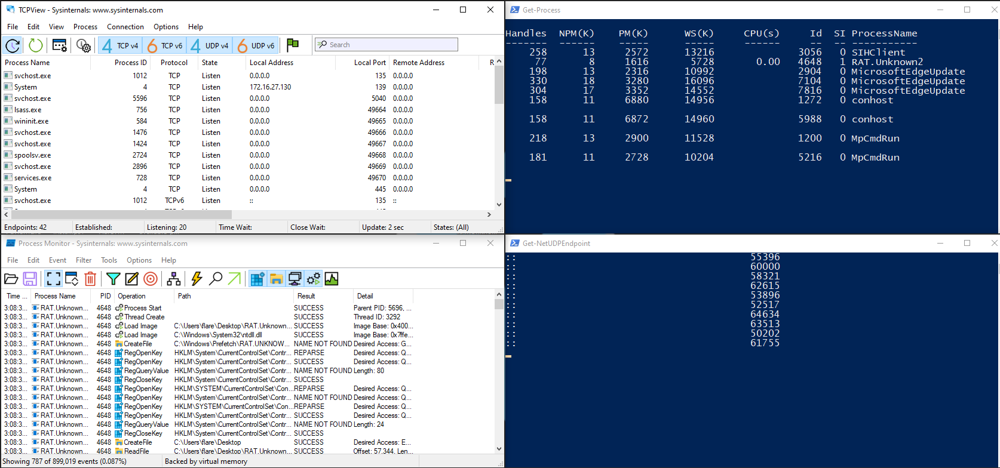
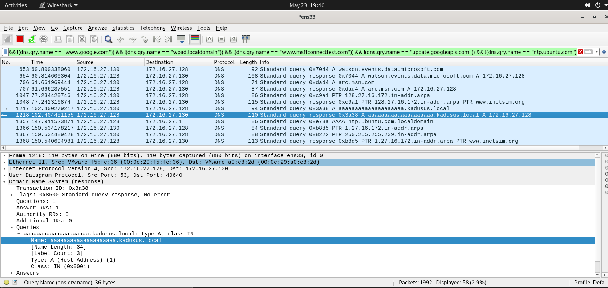
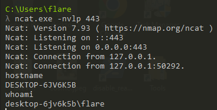

<center><b>RAT.Unknown2.exe</b></center> <br>
<center>Patrick Loyd</center>           <br>
<center>PMAT</center>                   <br>
<center>May 22, 2023</center>           <br>

---

[Malware Download](https://github.com/HuskyHacks/PMAT-labs/blob/main/labs/1-2.BasicDynamicAnalysis/RAT.Unknown2.exe.malz/RAT.Unknown2.exe.7z)
<br>

---

### <u>Static Analysis</u>
###### Hashes:
| Hashing Algorithm | Value |
| ------------------------ | ------------------------------------------------------------------------------------ | 
| md5                    | c211704777e168a5151de79dc87ffac7                                                   |
| sha1                   | 1f688b4872f8a740872b5cb6d58e2b9c7103143a                                           |
| sha256                 | 481eae82ac4cd1a9cfadc026a628b18d7b4c54f50385d28c505fbcb3e999b8b0                   |
| os                     | windows                                                                            |
| format                 | pe                                                                                 |
| arch                   | amd64                                                                              |
| path                   | RAT.Unknown2.exe.malz                                                              |

###### Virus Total:

[vt_full_link](https://www.virustotal.com/gui/file/481eae82ac4cd1a9cfadc026a628b18d7b4c54f50385d28c505fbcb3e999b8b0)


###### Strings:
Note: Links Defanged Using [Cyber Chef](https://gchq.github.io/CyberChef/)

```
@cmd.exe /c
@exit
@.local
@iterators.nim(189, 11) `len(a) == L` the length of the seq changed while iterating over it
@kadusus
<?xml version="1.0" encoding="UTF-8" standalone="yes"?><assembly xmlns="urn:schemas-microsoft-com:asm.v1" manifestVersion="1.0"><assemblyIdentity version="1.0.0.0" processorArchitecture="*" name="winim" type="win32"/><dependency><dependentAssembly><assemblyIdentity type="win32" name="Microsoft.Windows.Common-Controls" version="6.0.0.0" processorArchitecture="*" publicKeyToken="6595b64144ccf1df" language="*"/></dependentAssembly></dependency></assembly>
GNU C99 9.2-win32 20191008 -m64 -mtune=generic -march=x86-64 -g -O2 -std=gnu99 -fno-PIE
./mingw-w64-crt/crt/crtexe.c
./build/x86_64-w64-mingw32-x86_64-w64-mingw32-crt
```


###### API Calls:
Malicious API Calls [malapi](https://malapi.io/#)


- GetCurrentProcessId
- VirtualProtect
- GetCurrentThreadId
- TerminateProcess
- RtlAddFunctionTable
- RtlLookupFunctionEntry

### <u>Dynamic Analysis</u>

#### Dry Run <br>

No new connections or opened ports detected



#### Internet Simulation<br>

Malware reaches out to domain: aaaaaaaaaaaaaaaaaaaa[.]kadusus[.]local



The following detonations were performed by 
changing the hosts directory C:\Windows\System32\Drivers\Etc\hosts
to point the requested domain at the localhost.
A netcat listener was then created on port 443 to respond to any HTTPS traffic. 


The picture shows a reverse shell connection is enstablished when the malware is detonated.



##### Network Indicators:
The following picures are from the powershell command Get-NetTCPConnection and tcpview.exe.


##### Host Indicators:
This shows the processes and where they attempt to connect using Procmon.exe.


The malware also creates a new process for every command run on the system.


---


