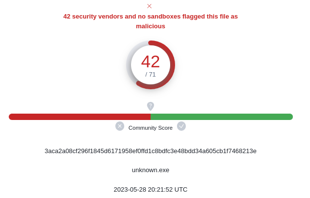
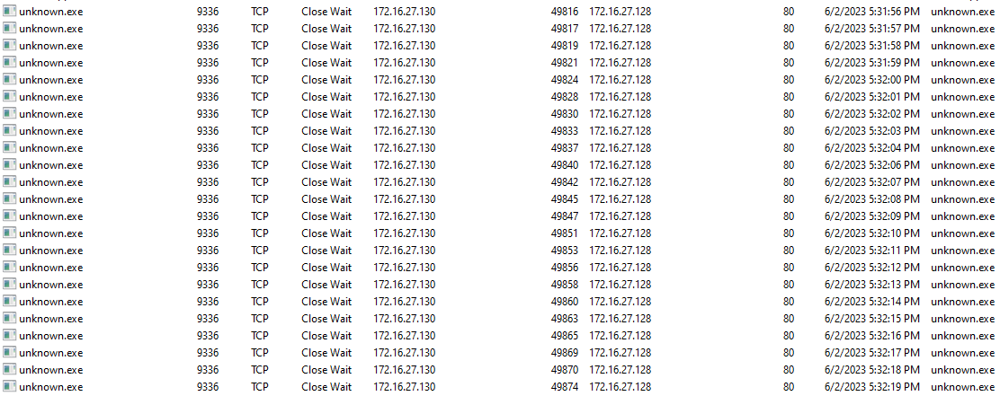
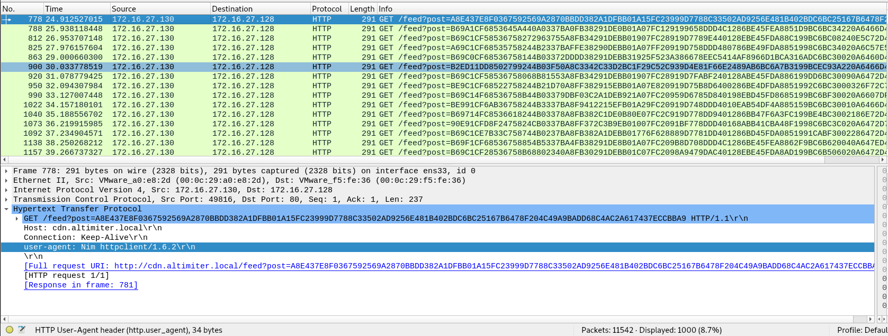

<center><b>Malware Name</b></center> <br>
<center>Patrick Loyd</center>           <br>
<center>Malware Source</center>                   <br>
<center>Date</center>           <br>

---

[Malware Download]()
<br>

---

### <u>Static Analysis</u>
###### Hashes:
| Hashing Algorithm | Value |
| ------------------------ | ------------------------------------------------------------------------------------ | 
| md5                    | b9497ffb7e9c6f49823b95851ec874e3
| sha1                   | 6c8f50040545d8cd9af4b51564de654266e592e3
| sha256                 | 3aca2a08cf296f1845d6171958ef0ffd1c8bdfc3e48bdd34a605cb1f7468213e
| os                     | windows
| format                 | pe
| arch                   | amd64
| names                   | unknown.exe.malz

###### Virus Total


[vt_full_link](https://www.virustotal.com/gui/file/3aca2a08cf296f1845d6171958ef0ffd1c8bdfc3e48bdd34a605cb1f7468213e/summary)


###### Strings:
Note: Links Defanged Using [Cyber Chef](https://gchq.github.io/CyberChef/)

```
@:houdini
@Authorization
@Host
@httpclient.nim(1144, 15) `false`
@Transfer-Encoding
@Content-Type
@Content-Length
@httpclient.nim(1082, 13) `not url.contains({'\r', '\n'})` url shouldn't contain any newline characters
@hxxp[://]cdn[.]altimiter[.]local/feed?post=
@Nim httpclient/1.6.2
@Desktop\cosmo.jpeg
@SikoMode
@iterators.nim(240, 11) `len(a) == L` the length of the seq changed while iterating over it
@ccc
@Mozilla/5.0
@C:\Users\Public\passwrd.txt
```


###### API Calls:
Malicious API Calls [malapi](https://malapi.io/#)

GetCurrentProcessId
VirtualProtect
GetCurrentThreadId
TerminateProcess
RtlAddFunctionTable
RtlLookupFunctionEntry
 


---

### <u>Dynamic Analysis</u>

#### Dry Run <br>

The binary deletes iteself if there is no internet connection and 
if the file cosmo.jped is not on the desktop.

#### Internet Simulation<br>

##### Network Indicators:

The process attempts to make multiple connections to the proxy host on port 80.



A DNS request for cdn.altimiter.local is made to the DNS proxy. 


The process attempts to make multiple GET requests to the domain.
The requests contain data emeded witin the path of the url post parameter, indicating data exfiltration.




##### Host Indicators:

A file is created in C:\Users\Public\passwrd.txt with a password stored in the file.


---

### Binary/Executable Analysis

The bulk of the main function is located in NimMainModule at offset 0x00417870.

--- 


