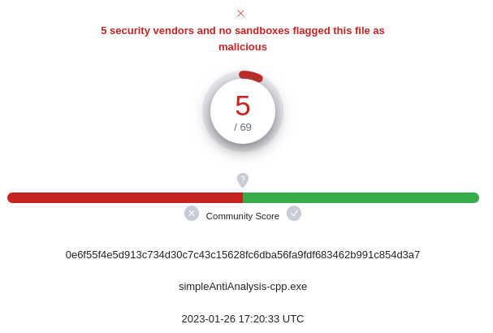
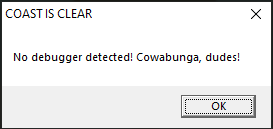
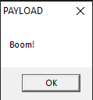
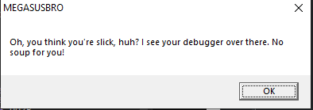
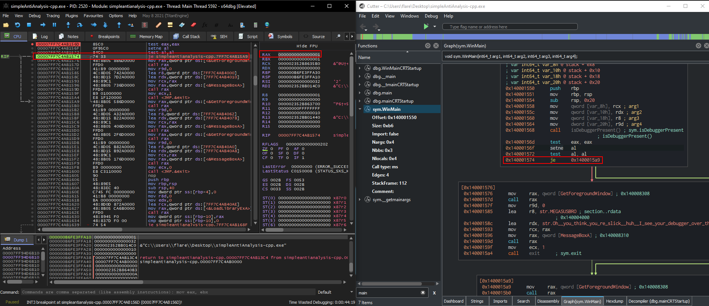
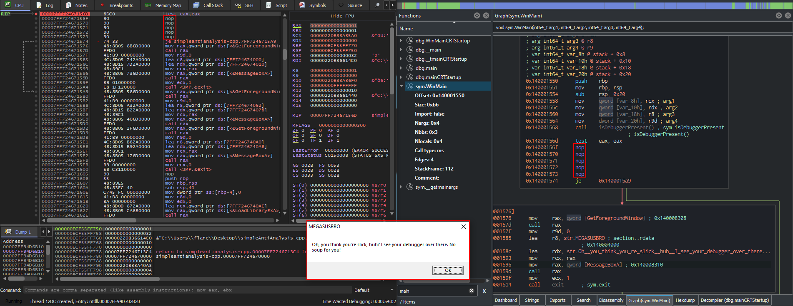

<center><b>simpleAntiAnalysis-cpp.exe</b></center> <br>
<center>Patrick Loyd</center>           <br>
<center>PMAT</center>                   <br>
<center>June 9, 2023</center>           <br>

---

[Malware Download](https://github.com/HuskyHacks/PMAT-labs/tree/main/labs/2-5.AntiAnalysis/1.simpleAntiAnalysis)
<br>

---

### <u>Static Analysis</u>
###### Hashes:
| Hashing Algorithm | Value |
| ------------------------ | ------------------------------------------------------------------------------------ | 
| md5                    | 40df92ca95cf7c221fe35b10d92d6f93                                                   |
| sha1                   | 7503481ff45e448f3b7ba767c6cbf4174f4edb98                                           |
| sha256                 | 0e6f55f4e5d913c734d30c7c43c15628fc6dba56fa9fdf683462b991c854d3a7                   |
| os                     | windows                                                                            |
| format                 | pe                                                                               |
| arch                   | x86                                                                              |
| names                  | simpleAntiAnalysis-cpp.exe                                                         |

###### Virus Total


[vt_full_link](https://www.virustotal.com/gui/file/0e6f55f4e5d913c734d30c7c43c15628fc6dba56fa9fdf683462b991c854d3a7/summary)


###### Strings:
Note: Links Defanged Using [Cyber Chef](https://gchq.github.io/CyberChef/)

```
Oh, you think you're slick, huh? I see your debugger over there. No soup for you!
COAST IS CLEAR
No debugger detected! Cowabunga, dudes!
PAYLOAD
IsDebuggerPresent
Boom!
```


###### API Calls:
Malicious API Calls [malapi](https://malapi.io/#)
 
- GetForegroundWindow
- VirtualProtect


---

### <u>Dynamic Analysis</u>

#### Dry Run <br>

The initial detonation gives two prompts. 
The first prompt has the title 'COAST IS CLEAR'.
The body of the first prompt reads 'NO debugger detected! Cowabunga, dudes!'




The second prompt has the title "PAYLOAD" and the body is "BOOM!"



---

### <u>Binary/Executable Analysis</u>

Running the debugger with the malware gives another prompt.



When the debugger is present, 
the function IsDebuggerPresent will return 1 or 0 (true/false).
The picture below shows a test done on the eax register storing the returned value.
If the debugger is present than the payload will not execute.



One interesting note is the redundancy in the flow control for this function which is as follows:

```
test eax, eax
setne al
test al, al
je 0x1400015a9

setne al and test al, al are both redundant instructions.
eax will be set to 1 if the debugger is present and 0 if the debugger is not present.
test eax, eax will set the zero flag if eax is 0 and will clear the zero flag if eax is not 0.
setne al will flip the al register to 1 if the previous test is equal and 0 and 1 if the previous test is equal to 0.
This means that al will always be set to the same return value as eax when IsDebuggerPresent returns.
This also means that in this program:
test eax, eax == test al, al 

This can also be proven by replacing the setne and following test with nop instructions.

```




--- 


